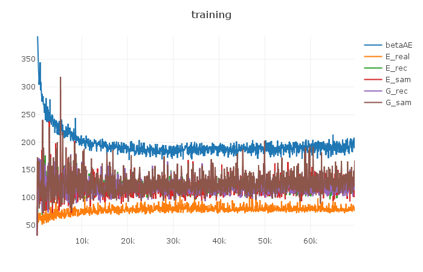
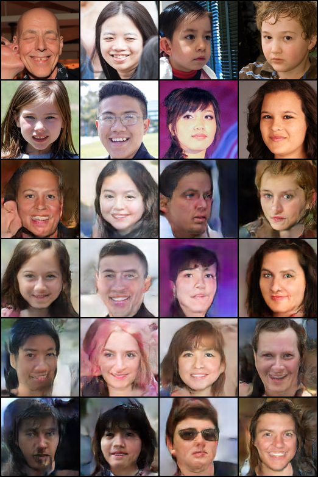
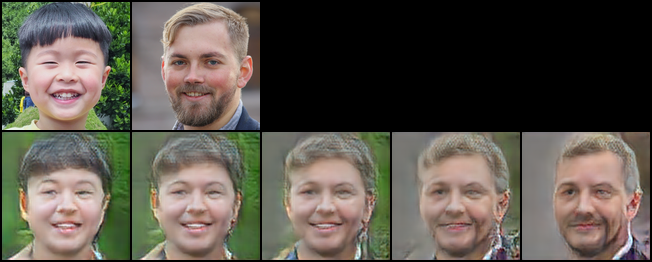

# IntroVAE-Pytorch

Pytorch Implementation for NeuraIPS2018 paper: 
[IntroVAE: Introspective Variational Autoencoders for Photographic Image Synthesis](https://arxiv.org/abs/1807.06358).

The rep. contains a basic implementation for IntroVAE.
However, due to no official implementation released,
some hyperparameters can only be guessed and can not reach the performance
as stated in paper. Issues and pull requests are welcome.


# Training
1. Download [FFHQ](https://github.com/NVlabs/ffhq-dataset)
thumbnails128x128 subset,
[CelebA](http://mmlab.ie.cuhk.edu.hk/projects/CelebA.html) dataset
will also do (but not tested).

2. Start Visdom server and run
```bash
python3 main.py --name FFHQt --root /path/to/FFHQ/thumbnails128x128 --batchsz 300
```
to train from strach.

Interrupt the training process when you find the image quality
not improving any more.

3. Interpolating in latent space.
```bash
python3 eval.py --load FFHQt/ckpt/vae_0000060000.mdl --input /path/to/FFHQ/thumbnails128x128/12345.png /path/to/FFHQ/thumbnails128x128/23456.png --output interp.png --n_interp 5
```

# Results
Tested for FFHQ 128x128 thumbnails.

- Training curve.



- Original, reconstructed and sampled images.



- Interpolation in latent space.


